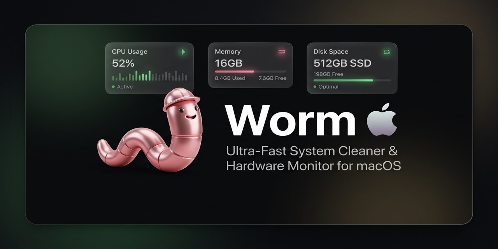

<div align="center">




# Worm Cleaner: Free, Open-Source MacBook & Windows Cleaner


**Worm Cleaner is a free disk cleaner, app uninstaller and system monitor for MacBook and Windows. Clear developer caches, remove leftovers, and watch your hardware. Native, transparent, and zero telemetry.**


[](LICENSE)
[](https://github.com/namdevnaman/worm/releases)
[-0078D6.svg?logo=windows)](https://github.com/namdevnaman/worm/releases)
[](https://github.com/namdevnaman/worm/releases)
[](https://swift.org)
[](https://dotnet.microsoft.com)
[](https://github.com/namdevnaman/worm/pulls)


[**What's new**](#whats-new-in-v104) · [**Download**](#download-worm-cleaner) · [**Features**](#features) · [**How it compares**](#worm-vs-commercial-cleaners) · [**FAQ**](#faq) · [**Setup guide**](SETUP.md) · [**Security policy**](SECURITY.md)


🌐 **Website:** <https://worm.clepsydratechnologies.com> — guides, comparisons and downloads at [worm.clepsydratechnologies.com](https://worm.clepsydratechnologies.com)

</div>

---

## What is Worm Cleaner?

**Worm Cleaner is a free, open-source disk cleaner, app uninstaller and system monitor for MacBook and Windows.** It frees up storage by removing developer caches (Xcode DerivedData, npm, Homebrew, Cargo, Gradle and more), browser caches, and the leftover files that uninstalled apps leave behind. It also shows live CPU, memory, disk and thermal stats from your menu bar (macOS) or system tray (Windows).

A MacBook with a few years of development on it can quietly lose tens of gigabytes to `DerivedData`, package manager caches and orphaned app data. Worm Cleaner finds that space, shows you exactly what it found, and deletes only what you tick.

Worm Cleaner is built as a transparent alternative to subscription cleaners such as CleanMyMac and CCleaner:

- **Free forever.** MIT licensed, no subscription, no upsell.
- **No telemetry.** It runs fully offline and sends nothing anywhere.
- **Native and lightweight.** Swift 6 + SwiftUI on macOS, .NET 9 on Windows. No Electron.
- **Safe by default.** You review every item before deletion, and personal folders are protected.
- **Auditable.** The complete list of deletable paths is `Sources/WormCore/ScanCatalog.swift`, and the complete list of protected paths is `Sources/WormCore/SafetyPolicy.swift`. You can read both before installing.

> **Not malware.** Worm Cleaner is not malware and not a self-replicating computer worm. It does not copy itself, does not modify other files, and makes no network calls while cleaning. The name refers to the earthworm that burrows through soil.
>
> **Who is it for?** Developers whose MacBook is full of Xcode and package manager caches, and anyone who wants a cleaner they can audit instead of trusting a black box.
>
> **Also known as:** a MacBook cleaner, a Mac cache cleaner, a Windows junk file remover, an app uninstaller, and a disk space analyser.

---

## What's new in v1.0.5

Two crash fixes, both the same underlying mistake, plus the tooling that stops it
coming back.

**Fixes**

- **Navbar tabs could abort the app.** Switching screens could terminate Worm
  with a SwiftUI view-graph type mismatch. The cause was blocking I/O inside the
  menu bar panel's view initialisers: `SystemMetrics.emptySnapshot()` shelled out
  to `ioreg` with a two-second timeout, and `AuditLog.totals()` read the entire
  deletion log. The main window and the menu bar panel are both `NSHostingView`s
  over one store, so as soon as both rendered, one blocked the main thread while
  the other was mid-update. `emptySnapshot()` is now genuinely empty, and both
  values are filled in off the main actor.
- **Cleaning could segfault mid-run.** The menu bar panel's Telemetry view read a
  computed property that ran `/sbin/route` and blocked in `waitUntilExit` — once
  per render, on the main thread. Cleaning publishes progress continuously, so
  the panel re-evaluated many times a second while every evaluation blocked the
  main thread. The lookup is now cached and computed off the main thread.
- **Tab switching no longer queues work it does not need.** Each click used to
  schedule its own uncancellable delayed swap, so a burst of clicks produced a
  backlog of view-type swaps landing inside each other's animations. Rapid clicks
  now coalesce to a single swap, and the content swap is no longer animated.

**Tooling**

- `Worm.app/Contents/MacOS/Worm --selftest` is a new diagnostic harness, mirroring
  the Windows build's existing `--selftest`. It reproduces the aborts above and
  guards them; `--quick` runs the crash probes in about four seconds.
- A source lint asserts that no view `body` or computed property blocks on I/O.
  Three separate crashes came out of that one mistake, and the lint is verified
  to fail on the original code. It mirrors the Windows build's XAML binding lint.
- `build-app.sh` and the release workflow no longer fall back to a hardcoded
  version number. A build with no tag used to silently become whatever literal
  was left in the file; they now refuse rather than ship a stale version in
  Finder and in the DMG name.

Upgrade from v1.0.4 with no configuration change. Your protect list and deletion
audit log are untouched by the upgrade.

### Previous: v1.0.4

Windows caught up with macOS. The six screens now exist on both platforms, and
Clean Screen blackout mode ships on both.

**Safety**

- AppData is no longer enumerated wholesale. Caches are reached through explicit
  leaf paths instead.
- The WSL package rule is gone, and NuGet's shared cache is no longer a target.
- **Old Windows Installations** is opt-in and can only be ticked item by item,
  never through its parent category row. A missed rollback leaves a machine
  unbootable, so it is never selected in bulk.

**Performance**

- Apps and Leftovers no longer hang on large installs. Enumeration is
  registry-first, install identities are cached once instead of per check, and
  sizing no longer walks whole directories on the UI thread.

**Motion and Clean Screen**

- Animations reproduce the macOS springs rather than approximating them. The three
  springs from `Theme.swift` are evaluated as real damped-spring curves, derived
  analytically from the Swift `response` and `dampingFraction` values.
- Clean Screen draws one borderless window per monitor. Escape is caught with a
  low-level keyboard hook, because the overlay cannot take focus.
- The navigation pane is drag-resizable.

**Diagnostics**

- `Worm.exe --selftest` measures Escape handling and spring behaviour instead of
  asking you to eyeball them. See the FAQ below.
- 50 tests, including a lint that rejects XAML bindings the runtime would throw
  on. XAML compiles to BAML, so a bad binding is invisible to `dotnet build` and
  only fails once a list has items — this catches it before release.

---

## Download Worm Cleaner

Latest release: **v1.0.5**

| Platform | Format | Download | Notes |
| --- | --- | --- | --- |
| macOS 14+ (Apple Silicon & Intel) | DMG installer | [**Worm-Installer.dmg**](https://github.com/namdevnaman/worm/releases/latest/download/Worm-Installer.dmg) | Drag to Applications. Includes a Gatekeeper helper. |
| macOS 14+ (Apple Silicon & Intel) | ZIP | [**Worm-macOS.zip**](https://github.com/namdevnaman/worm/releases/latest/download/Worm-macOS.zip) | Portable `Worm.app` bundle. |
| Windows 10 / 11 (x64) | ZIP | [**Worm-Windows-x64.zip**](https://github.com/namdevnaman/worm/releases/latest/download/Worm-Windows-x64.zip) | Self-contained, no runtime required. Includes `Install-Worm.ps1`. |

> These use GitHub's `releases/latest/download/` path, so they always resolve to
> the newest published release and never break when a version is bumped. The
> [Releases page](https://github.com/namdevnaman/worm/releases) is the place to
> check what *is* current.

> **Windows note:** Worm is not code-signed, so SmartScreen may block it on first
> launch. Extract the ZIP and double-click **`Install.cmd`** — it removes the
> Mark-of-the-Web and installs without admin rights. See
> [Windows: if SmartScreen blocks Worm](#windows-if-smartscreen-blocks-worm).

See all versions on the [Releases page](https://github.com/namdevnaman/worm/releases).

---

## Features

### Mac cleaner for developers (macOS)

Reclaim tens of gigabytes taken up by build tools and system processes.

This table is transcribed from `Sources/WormCore/ScanCatalog.swift`, which is the
authoritative list — every deletable path on macOS, one labelled entry each. If
the two ever disagree, the code is right.

| Category | What Worm cleans |
| --- | --- |
| **Xcode & Swift** | `DerivedData`, Xcode build products, the Xcode cache, Simulator cache, XCTest device data, SwiftPM cache |
| **Package managers** | npm, tnpm, Yarn (classic and v2), Corepack, node-gyp, Homebrew downloads, Cargo registry cache, Rust toolchain downloads, pip, uv, Poetry, pypoetry, pytest, mypy, Ruff, PyInstaller, RubyGems, Bundler, rbenv, Composer, CPAN, Hex, opam, pre-commit, Gradle build cache and daemon logs |
| **Other toolchains** | Go build cache, Bazel, Zig, Terraform plugin cache, kubectl, AWS CLI, curl, wget, Jupyter runtime |
| **Browsers & Electron apps** | Chrome, Edge, Brave, Firefox, Opera, Comet, Arc, Vivaldi, Helium, Yandex, Kagi, Dia, and Electron |
| **Editors & bundlers** | VS Code, Cursor, Zed, JetBrains, Vite, webpack, Parcel, Turborepo, TypeScript, ESLint, Prettier |

Items go to the macOS **Trash** by default, so nothing is permanently deleted unless you choose it.

#### What the macOS cleaner deliberately does **not** clean

Several widely-used "Xcode cleaners" will happily delete these. Worm refuses,
because none of them can be rebuilt from your machine:

| Path | Why it is protected |
| --- | --- |
| `~/Library/Developer/Xcode/Archives` | Holds distribution binaries you have shipped or are about to ship |
| `~/Library/Developer/Xcode/iOS DeviceSupport` | Symbol bundles generated by your compiler for a specific device and OS build |
| `~/Library/Developer/CoreSimulator/Profiles/Runtimes` | Installed simulator runtimes; a multi-gigabyte re-download |
| `~/Library/Developer/Xcode/DocumentationCache` | Toolchain state, not a cache |
| `~/Library/Developer/CoreSimulator/Devices` | Your simulator device pairs |

CocoaPods is **not supported** — there is no rule for it. Use
`pod cache clean --all`, or add one in `ScanCatalog.swift` and open a PR.

Docker on macOS is **reported read-only**, not cleaned: image layers and
container state are easy to misjudge, so a scan surfaces them for inspection
without offering them as deletion targets. The Docker Desktop builder cache *is*
cleaned on Windows.

Safari's application cache is not a target either; only Safari's logs
(`~/Library/Containers/com.apple.Safari/Data/Library/Logs`) are.

The full protected list, with the reasoning for each entry, is in
`Sources/WormCore/SafetyPolicy.swift`.

### Uninstall Mac apps and remove leftovers

Dragging an app to the Trash leaves files behind. Worm finds them.

- **Orphan detection** across `~/Library/Application Support`, `Preferences`, `Caches`, `Saved Application State` and `WebKit`.
- **Positive absence verification.** Worm checks app bundles in system paths and Spotlight to confirm an app is really uninstalled before flagging its files.
- **Granular review.** Every cache target and leftover folder is listed with its size and path, and each one carries its own checkbox. Nothing is deleted unless it is ticked.

### Menu bar system monitor (macOS)

- Live CPU core load and process count
- Memory breakdown: App, Wired, Compressed
- Disk capacity and reclaimed storage
- Thermal and fan status
- Left-click for live metrics, right-click for the context menu

### Security and auditability (macOS)

- Guided **Full Disk Access** setup for macOS privacy (TCC) permissions
- Every operation is logged locally to `~/Library/Logs/Worm/deletions.tsv`

### Windows cleaner

66 scan rules across 12 categories, grouped in a sidebar with tri-state
per-category selection. Every target carries its own checkbox. A thirteenth
category, the Recycle Bin, has no scan rules — see the note below the table.

| Category | Examples |
| --- | --- |
| **Developer Tools** | npm, pnpm, Yarn, NuGet, pip, Cargo registry, Gradle task-output cache, Android build cache, VS / VS Code / Cursor / JetBrains caches |
| **App Caches** | Per-application cache folders, roaming application cache, Chromium `Code Cache` / `GPUCache`, Explorer thumbnails, Internet Explorer cache |
| **Browsers** | Chrome, Edge, Brave, Firefox, Opera, Vivaldi — across **every** profile, not just `Default` |
| **Cloud & Office** | OneDrive, OneDrive setup logs, Dropbox, Teams |
| **AI Tools** | Claude Desktop, Codex logs, OpenCode, Copilot |
| **Apps & Utilities** | Discord, Slack, Teams webview, Spotify, Figma, Unity Hub, Obsidian, Zoom, VS Code Insiders |
| **Virtualization** | Docker Desktop builder cache, WSL, Hyper-V snapshots, BlueStacks |
| **User Essentials** | Application crash reports, LiveLock error reports, DirectX shader cache |
| **System Caches** | `%TEMP%`, `C:\Windows\Temp`, WER archives, Delivery Optimization, Prefetch, Windows shader cache |
| **Logs** | User log files, application log folders, npm logs, VS Code logs, Gradle daemon logs |
| **Old Windows Installations** | `Windows.old`, previous Windows installation folders, Windows upgrade files, WinSxS backup, `Windows Installation Image` (ESD) |
| **Misc** | Minidumps, superseded installers, diagnostic trace files |
| **Recycle Bin** | *No scan rules.* Measured and emptied across every fixed volume via the Shell API |

> **Why Recycle Bin is different.** It has no filesystem path, so it cannot be
> walked by a scan rule or guarded by the path-based safety policy. It is
> measured and emptied through the shell instead, and every action still lands
> in the audit log. `WindowsScanCatalog.IsSpecialCategory` declares this
> explicitly so the category list stays complete.

Age gates are applied per rule (7 days for logs and temp, 30 for state). Items go
to the **Recycle Bin** by default.

> `C:\Windows\SoftwareDistribution` is deliberately **excluded**. Windows owns that
> tree and its age cannot prove it stays inactive, so it is never cleaned here.

### Windows app uninstaller

- Enumerates installed apps from the `HKLM` and `HKCU` uninstall registry keys — the same list Programs and Features shows.
- Sort by size or name, filter as you type.
- Removal runs the app's **own registered uninstaller**, preferring the quiet command. Worm never hand-deletes an install directory, because that leaves a half-uninstalled app.
- Protected apps — Visual Studio, .NET runtimes and SDKs, Microsoft components — cannot be ticked. Running apps are blocked until quit.
- Uninstall registry entries marked as system components or update hotfixes are hidden.

### Windows uninstalled-app leftovers

- Scans `%APPDATA%` and `%LOCALAPPDATA%` for folders left by uninstalled software.
- **Positive absence verification** using token matching against every registered app, plus a second check against each app's install location. This is deliberately not substring matching, which both hid real orphans and flagged live ones.
- Grouped by app with expand/collapse, tri-state selection and a per-location size breakdown.
- **Needs review** badges on traces that look like your own data — documents, bookmarks, history, databases. These cannot be ticked silently.

### Windows disk analysis

- Capacity gauge across every fixed volume, with warn at 85% and danger at 92%.
- Biggest folders one level into your profile, click to open.
- Large-file finder with adjustable threshold. **Read-only** — it reports, it never deletes.

### Windows system tray

- Left-click the tray icon for a live panel: CPU, memory, free disk, uptime, and total bytes reclaimed.
- **Reclaimed** is read back from the audit log, so it only ever reports bytes that were actually removed.

### Windows hardware monitor

- CPU utilization via `GetSystemTimes`
- RAM usage via `GlobalMemoryStatusEx`
- Total, free and used space across every mounted NTFS/FAT32/exFAT volume
- Top processes by working set
- System facts: edition, build, architecture, cores, uptime
- Health checks for disk, memory and CPU with OK / Notice / Action needed

---

## Diagnostics: `--selftest`

```bash
Worm.app/Contents/MacOS/Worm --selftest            # full suite, ~2 min
Worm.app/Contents/MacOS/Worm --selftest --quick    # crash regression only, ~4s
Worm.app/Contents/MacOS/Worm --selftest "two hosting"   # one probe by name
```

It exercises the parts that cannot be unit-tested and reports to stdout and to
`~/Library/Logs/Worm/selftest.txt`. Exit code is 0 when everything survives.

It exists because of a crash that shipped: clicking a navbar tab could abort the
process with a SwiftUI view-graph type mismatch. There was no way to catch that
in a test, because it terminates the process rather than throwing — so the only
honest signal is whether the process is still alive. `--quick` is the gate; the
full suite renders every tab synchronously and is for deliberate use.

`swift test` does **not** build in this project with the Command Line Tools: the
Swift Testing and XCTest macro plugins ship with Xcode. That gap is why the
harness is a flag on the binary rather than a test target, and it mirrors how
the Windows build already works (`--selftest`, exit code).

---

## Safety: how Worm protects your data

1. **Inspect before action.** Every cache entry and leftover is listed with a per-item checkbox, and cleaning only touches what you ticked.
2. **Protected paths.** Personal folders are resolved through the Windows known-folder registry keys and the macOS equivalents, so a relocated OneDrive or domain-redirected `Documents` is still protected. Matching is prefix-aware and case-insensitive.
3. **Running processes warn, they do not silently pass.** A running app's cache is cleanable but flagged. An open file handle is never deleted.
4. **Trash first on macOS, Recycle Bin first on Windows.** Recoverable by default.
5. **Registry cross-check on Windows.** Only true orphans are flagged, proven by token matching rather than substring matching.
6. **Local audit log.** Every destructive operation is appended to `%LOCALAPPDATA%\Worm\Logs\deletions.tsv` (Windows) or `~/Library/Logs/Worm/deletions.tsv` (macOS).
7. **Blast-radius allowlist.** Every path a rule produces is checked against a cleanable-root set *derived from the rules themselves*, so a wrong rule still cannot delete outside a folder the catalog declares cleanable.
8. **Open source.** Read the code, build it yourself, verify the claims.

### Verify your download

Every release publishes `SHA256SUMS.txt` alongside the binaries, in GitHub Releases and at
<https://worm.clepsydratechnologies.com/SHA256SUMS.txt>. The Windows ZIP contains its own
copy covering `Worm.exe`.

```sh
# macOS
shasum -a 256 ~/Downloads/Worm-Installer.dmg

# Windows PowerShell
Get-FileHash -Algorithm SHA256 Worm-Windows-x64.zip
```

Current digests for **v1.0.5**:

```
d3dd58c3165ad438c5d0db749807b29ba8303901fe47482ee74f10798d4fd88c  Worm-Installer.dmg
6afffb5bf0ea119984802e2ba051ebfac99bc38083b919839d6110fd4485532a  Worm-macOS.zip
0169d3282e79f2cb8c7ff386c379c4c6ad0f07d29efae5267fbae6d17147e6af  Worm-Windows-x64.zip
```

If a digest does not match, do not run the file.

### macOS will warn you on first launch

Worm is **not notarised**. It is an independent project without a paid Apple Developer
account, so the build carries no notarisation ticket and Gatekeeper blocks it on first
open. This is a packaging gap, not a security finding — it is exactly what an unnotarised
binary looks like.

To open it: **System Settings → Privacy & Security → Security → Open Anyway**, or clear the
quarantine flag:

```sh
xattr -cr /Applications/Worm.app
```

Rather than judge the binary by that warning, verify the checksum above, read the source, or
build it yourself.

To report a vulnerability, use GitHub's
[private security advisory](https://github.com/namdevnaman/worm/security/advisories/new)
rather than a public issue. See [SECURITY.md](SECURITY.md).

---

## Worm vs commercial cleaners

| | Typical commercial cleaners | Worm for Mac | Worm for Windows |
| --- | --- | --- | --- |
| **Price** | Recurring subscription | Free (MIT) | Free (MIT) |
| **Source code** | Closed | Open | Open |
| **Framework** | Often Electron / web wrapper | Swift 6 + SwiftUI | .NET 9 + WPF |
| **Telemetry** | Often embedded analytics | None (offline) | None (offline) |
| **Idle RAM** | 180 to 450 MB | Under 35 MB | Under 42 MB |
| **Xcode / temp scan** | ~12 s | Under 0.8 s | Under 0.6 s |
| **Portable** | No | No (`.app` bundle) | Yes (extract-and-run ZIP) |

<sub>Figures are measured on the author's test machines. See [SETUP.md](SETUP.md) for how to reproduce them.</sub>

---

## Installation

### macOS

1. Download [`Worm-Installer.dmg`](https://github.com/namdevnaman/worm/releases/latest/download/Worm-Installer.dmg).
2. Drag `Worm.app` into `/Applications`.
3. Open it. If Gatekeeper blocks it, go to **System Settings → Privacy & Security → Open Anyway**, or double-click `Open-If-Blocked.command`.
4. Grant **Full Disk Access** in System Settings so Worm can scan app containers thoroughly.

### Windows

Three ways, easiest first.

**1. Double-click (no admin needed)**

1. Download and extract [`Worm-Windows-x64.zip`](https://github.com/namdevnaman/worm/releases/latest/download/Worm-Windows-x64.zip).
2. Double-click **`Install-Worm.cmd`**.

That clears the Mark-of-the-Web that makes SmartScreen block an unsigned build, verifies the download against `SHA256SUMS.txt`, installs to `%LOCALAPPDATA%\Programs\Worm`, adds Start-menu / Desktop / start-up shortcuts, registers Worm under **Settings → Apps → Installed apps**, and launches it. Uninstall with **`Uninstall.cmd`** or from Settings.

**2. Scoop**

```powershell
scoop bucket add worm https://raw.githubusercontent.com/namdevnaman/worm/main/worm-windows/packaging/scoop/worm.json
scoop install worm
```

**3. PowerShell**

```powershell
powershell -NoProfile -ExecutionPolicy Bypass -File .\Install-Worm.ps1
```

Add `-Purge` to also delete logs and settings, or `-InstallDir 'D:\Apps\Worm'` to relocate. Worm installs per-user, so **no administrator rights are required** — deliberately, because an unsigned MSI would trigger a UAC "unknown publisher" prompt and MsiExecTrust block, which is a worse first-run experience than a portable ZIP.

### Build from source

**macOS**

```bash
git clone https://github.com/namdevnaman/worm.git && cd worm
./scripts/build-app.sh && cp -R dist/Worm.app /Applications/
```

**Windows**

```powershell
cd worm-windows
scripts\build.bat
```

That produces `worm-windows\dist\win-x64\` and a packaged
`worm-windows\dist\Worm-Windows-x64.zip` with checksums.

---

## FAQ

### Is Worm safe to use?
Yes. Worm lists everything before deletion, protects personal folders and running processes, moves files to the Trash on macOS, and logs every operation locally. The full source is open for review.

### Is Worm malware?
No. Worm is source code you can read in full, under the MIT licence.

It is not code-signed, and that is the whole reason Windows warns about it. An unsigned binary has no publisher signature, so SmartScreen shows a warning for *any* app that has never been downloaded before — including honest ones. That is the same warning a genuinely malicious tool would trigger, which is why the question is fair.

Four ways to check rather than take our word for it:

1. **Read the code.** Every line is in this repository. The destructive paths are `WindowsReclaimer`, `WindowsSafetyPolicy` and `WindowsRecycleBin` on Windows, and `Reclaimer` and `SafetyPolicy` on macOS.
2. **Build it yourself** using the instructions above and run your own build. That is the real answer to "can I trust it".
3. **Watch the network.** Worm makes no outbound connections at all. There is no analytics SDK, no update pings, no crash reporting. On macOS the only network call in the whole app is the optional update check, and it is off until you ask for it.
4. **Read the audit log.** Every single deletion is appended to a plain-text TSV file on your own machine — `%LOCALAPPDATA%\Worm\Logs\deletions.tsv` on Windows, `~/Library/Logs/Worm/deletions.tsv` on macOS. If a cleaner were doing something you did not ask for, it would be in that file.

If you would rather not run an unsigned binary at all, that is a completely reasonable position and the best answer is to build from source.

### Is Worm really free?
Yes. It is MIT licensed with no subscription, ads or paid tier.

### Does Worm collect data or use telemetry?
No. Worm works fully offline and has no analytics or tracking.

### How do I clear Xcode DerivedData on a Mac?
Open Worm, run a scan, select **Xcode & iOS** items such as `DerivedData`, review the list, and clean. Items go to the Trash by default.

### How do I completely uninstall a Mac app and remove its leftover files?
Delete the app as usual, then run Worm's leftover scan. It finds orphaned files in `~/Library` and lets you review each one before removal.

### Which package manager caches can Worm clean?
npm, tnpm, Yarn (classic and v2), Corepack, node-gyp, Homebrew downloads, Cargo registry cache, Rust toolchain downloads, pip, uv, Poetry, pypoetry, pytest, mypy, Ruff, PyInstaller, RubyGems, Bundler, rbenv, Composer, CPAN, Hex, opam, pre-commit, Gradle, Go, Bazel, Zig, Terraform, kubectl and AWS CLI.

CocoaPods is **not** supported — there is no rule for it in `ScanCatalog.swift`. Use `pod cache clean --all`.

The complete, authoritative list is `Sources/WormCore/ScanCatalog.swift`.

### Does Worm clean Xcode Archives, iOS DeviceSupport or simulator runtimes?
No, and it will not offer them as targets. Those paths are protected in `Sources/WormCore/SafetyPolicy.swift` because none of them can be rebuilt from your machine: an archive holds a binary you already shipped, device support holds symbols for a specific device and OS build, and simulator runtimes are a multi-gigabyte download.

If you have seen a tool offer to delete these, that tool is the risk, not the protection.

### Is Worm an alternative to CleanMyMac or CCleaner?
It covers similar ground (cache cleanup, uninstall leftovers, system monitoring) as a free, open-source tool with no telemetry. It is younger and has a narrower feature set, so compare it against what you need.

### Which systems does Worm support?
macOS 14.0 or later (Apple Silicon and Intel) and Windows 10 / 11 (x64).

### Why does macOS block Worm on first launch?
The app is not distributed through the App Store. Use **Open Anyway** in System Settings → Privacy & Security, or run `Open-If-Blocked.command` from the DMG.

### Windows: if SmartScreen blocks Worm
Worm is open source and **not code-signed**, so its binaries carry a Mark-of-the-Web and Windows SmartScreen treats them as unknown. This happens on double-click *and* when launching from `cmd` or PowerShell — the block is caused by the download, not the launcher.

Easiest fix — extract the ZIP and double-click **`Install-Worm.cmd`**. It clears the Mark-of-the-Web and installs for you.

Or do it manually: right-click the ZIP → **Properties** → tick **Unblock** → **Apply**, or after extracting run:

```powershell
Get-ChildItem -Recurse -File | Unblock-File
```

If SmartScreen still prompts, choose **More info → Run anyway**.

A fully click-through, warning-free install requires a paid code-signing certificate; Worm is MIT open source, so it ships un-signed by design.

### How do I check Clean Screen and the animations work?

Run this in the extracted folder:

```cmd
Worm.exe --selftest
```

It measures rather than guesses. It installs a real low-level keyboard hook and
injects a real Escape to confirm the key actually exits Clean Screen, checks that
non-Escape keys still pass through, and compares each spring's overshoot and peak
against the values in `Theme.swift`. It also runs one real animation and samples the
rendered value every frame, which is what proves the bounce actually appears.

The same report is written to `%LOCALAPPDATA%\Worm\Logs\selftest.txt` if you would
rather not read the console.

### Worm.exe is gone from the Windows download, why?
The single-file `Worm.exe` from v1.0.2 was 68 MB and unreliable: it bundled WPF's compiled XAML and `.g.resources` into a *compressed* single-file bundle, which WPF cannot reliably read, so the app could exit before drawing a window. Windows now ships a self-contained **folder inside `Worm-Windows-x64.zip`**. It is a larger download but has no bundling layer to fail.

### Why does Worm need Full Disk Access?
macOS protects some app container folders. Without Full Disk Access, Worm cannot see them, so scans would miss leftovers.

---

## Technology stack

| | macOS | Windows |
| --- | --- | --- |
| **Language** | Swift 6.0 | C# 13 / .NET 9 LTS |
| **UI** | SwiftUI (macOS 14+) | WPF with ModernWpfUI, Mica & Acrylic |
| **System access** | Mach kernel APIs, IOKit, libproc | Win32 P/Invoke (`kernel32`, `shell32`, `dwmapi`) |
| **Screens** | Clean, Leftovers, Apps, Disk, Status, Settings | Clean, Leftovers, Apps, Disk, Status, Settings |
| **Scan rules** | 166 | 66 across 12 categories |
| **Safety refusal reasons** | 23 | 19 |
| **Tests** | Swift Testing, 53 tests | xUnit, 36 tests over the safety invariants |
| **Build / packaging** | SwiftPM, Universal Binary | Self-contained folder, shipped as a ZIP |

Windows ships the same six screens as macOS, including **Clean Screen** blackout mode
(one borderless window per monitor, exit with Esc or a click). The macOS privacy guide
remains macOS-only.

`Old Windows Installations` is opt-in on both platforms: it must be ticked item by
item, never selected by its parent category row, because a missed rollback leaves a
machine unbootable.

---

## Contributing

Bug reports, new scan rules and pull requests are welcome.

1. Fork the repo.
2. Create a branch: `git checkout -b feature/new-scanner`
3. Commit: `git commit -m "Add scan rule for new tool"`
4. Push and open a Pull Request.

Have an idea for a new cache target? [Open an issue](https://github.com/namdevnaman/worm/issues).

---

## License

Released under the [MIT License](LICENSE).

## Author

Built and maintained by [Naman Namdev](https://github.com/namdevnaman).

If Worm freed up space on your machine, please **star the repo**. It helps others find it.

<!--
Search keywords: worm cleaner, worm macbook cleaner, macbook cleaner, mac cleaner,
free mac cleaner, open source mac cleaner, macOS disk cleanup, mac cache cleaner,
clean my mac alternative, cleanmymac alternative, clear Xcode DerivedData,
developer cache cleaner, uninstall mac apps completely, remove app leftovers,
macbook disk space, free up space on macbook, menu bar system monitor,
worm windows cleaner, windows junk file remover, windows temp file cleaner,
windows disk cleanup, ccleaner alternative, uninstall apps windows,
windows app uninstaller, orphaned app data, pc junk cleaner,
no telemetry cleaner, open source cleaner app, privacy first cleaner
-->
